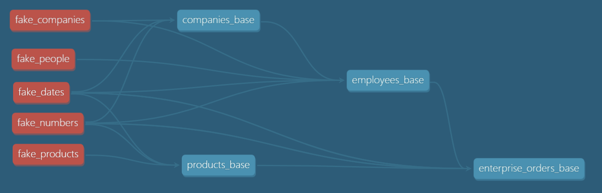

One of the most difficult tasks when learning DBT is finding good datasets that update over time. This
project uses DBT to generate fake data that will update daily. With simple commands, we can generate a history of data.
Then, we can update the data each day to mimic a real company. This data is enough to practice incremental tables and snapshots.

This project is in early stages, with just three tables; companies_base, employees_base and enterprise_orders_base. 
Right now, we can add new records each day, but existing records will never change. Future enhancements will include: 

This should work on most databases. See macros/xdb_random.sql to see how the random macro is applied in various dbs. If it 
does not work for a specific database, please open an issue. 

- Additional models for public customers and orders, tiered pricing, and something marketing related. Maybe email campaigns or Google ads. 
- Macros to randomly change existing dimensional records
- Macros to introduce data-quality errors that will require fixing. 
- Better code validation (Using multiple methods to demonstrate possibilities)


### Generating Fake Data 

**Load the seed data:**
- dbt seed
- This only needs to be run once

**Load a history:**

All models support the following optional arguments
- start_date - default current_date() - 1 
- end_date - default current_date() - 1
- max_per_day - default 3 for companies, 10 for employees
- allow_zero - default true. True allows a day to have 0 records.
- dbt build -s tag:base-table --vars '{start_date: "some_date", end_date: "some_date", max_per_day: some_number, allow_zero: true|false}'

example: Create records starting 2023-01-01 and ending 2023-08-20. 0-3 companies, 0-10 employees \
dbt build -s tag:base-table --vars '{start_date: "2023-01-01", end_date: "2023-08-20"}'

example: Create records starting 2023-01-01 and ending 2023-08-20. 1-3 companies per day, 1-10 employees per day \
dbt build -s tag:base-table --vars '{start_date: "2023-01-01", end_date: "2023-08-20", allow_zero: false}'

example: Create company records for 2023-01-01 and ending 2023-08-20, 1-20 employees per day \
dbt build -s employees_base --vars '{start_date: "2023-01-01", end_date: "2023-08-20", num_records: 20, allow_zero: false}'

example: Create a ton of orders around Christmas time
dbt build -s enterprise_orders_base --vars '{start_date: "2022-12-15", end_date: "2022-12-21", num_records: 50, allow_zero: false}'

**Load daily records:**

example: Create records for yesterday. 0-3 companies, 0-10 employees \
dbt build -s tag:base-table

example: Load companies for yesterday with 1-3 companies \
dbt build -s companies_base --vars '{num_records: 3, allow_zero=false}'

example: Load employees for yesterday with 0-3 employees \
dbt build -s companies_base --vars '{num_records: 3}'


**Ways to Use this Project**

First, do the [free DBT tutorials](https://courses.getdbt.com/collections). They are short and very good. They will teach the basics of DBT, even if they do not have data
that updates every day. Start with fundamentals, then materializations, then jinja and macros. 

Once you understand the basics. Get this project running in your own environment or in DBT cloud. Start building models and fixing things. Practice stuff you want to learn. 

In general, the output tables are intended to be sources in another project. A good practice is to keep this project completely
separate and create a sources.yml in your own project. With this method, you can still modify this project if the output data
does not meet your needs. That being said, you own your own learning journey, use this project however you see fit.  

To see documentation on each table, look in *_base.yml or run:
- dbt docs generate
- dbt docs serve

**Challenges to Get Started**
- Create a history of companies, employees and orders
- Add more orders for specific date ranges to show increased activity
- Configure this project to run in DBT Cloud, Airflow, Github Actions, or any orchestrator (Update data daily)
- Create a new project and add the tables created by this project as source
- Use snapshots to create SCD type-2 dimensions for companies and customers
- Separate enterprise_orders_base into categories and products tables
- Create a view that generates invoices for all orders
- Create a seed with company ids and discounts (maybe as percentages), apply those discounts to invoices
- Imagine a custom called in to get special pricing for specific items? How would you override prices?
- Delete a random company, but leave the employees. How would you handle that situation where employees have no company? 
- Use a different database for this project. It will fail. Try to fix it. 


### How data was created:

In order to generate daily-updated records, we need a generic source of records to pull from. 
In this case we used Python and [Faker](https://faker.readthedocs.io/en/master/). Faker makes
it easy to generate random entities, with often-funny results, like a "canned tuna" product under
the childrens category. 

For each entity, we generated 10,000 random rows in a CSV file. These CSV
files are loaded as seeds by DBT. From there, we use SQL with a whole lot of inefficent queries
and rand(). Fake_dates and fake_numbers exist to make the queries a little more efficient.  




To see the code, run scripts/generate_fake_entities.ipynb using Jupyter. To run the code, you will need to install Faker and [faker-commerce](https://github.com/nicobritos/python-faker-commerce). 

```
pip install faker faker-commerce
```
